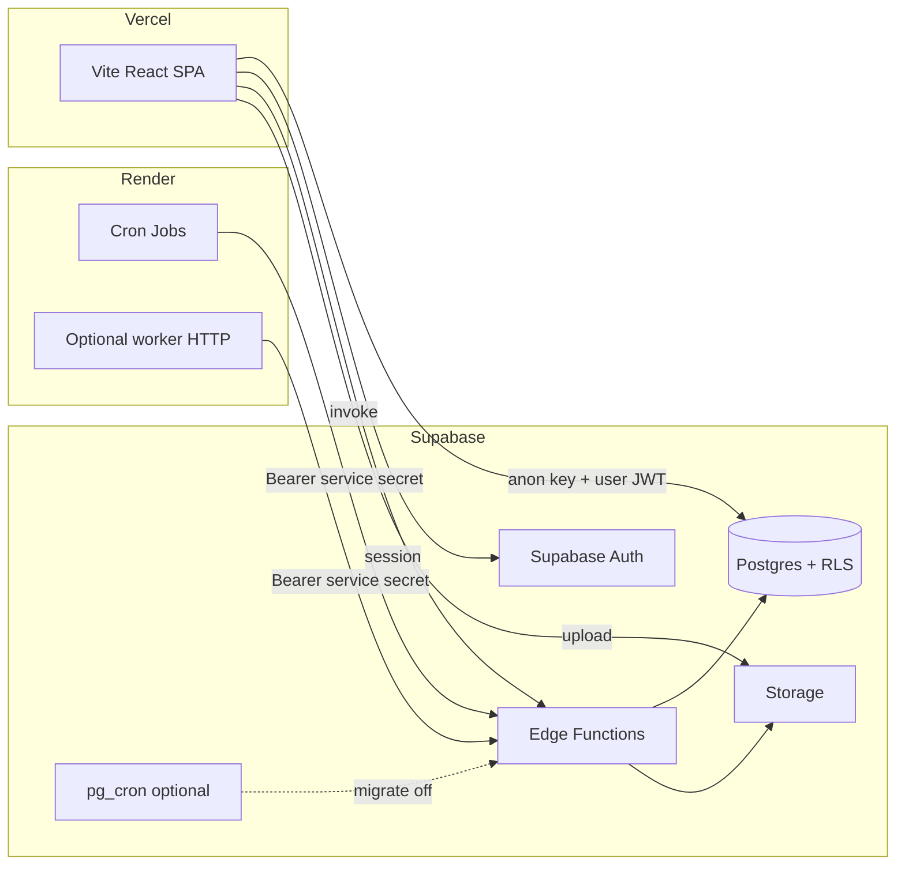

# WDIWF — Production architecture (Vercel + Render + Supabase)

This document describes a **boring, reliable** split that matches your constraints: **Vercel** for the SPA, **Supabase** as system of record (Postgres, Auth, Storage, Edge Functions), and **Render** for **scheduled / worker-style** workloads when you outgrow or want to replace database-initiated cron.

## Target shape

| Layer | Platform | Responsibility |
|--------|-----------|----------------|
| **Web UI** | Vercel | Static build of Vite + React Router; SPA rewrites for deep links |
| **User-facing API** | Supabase Edge Functions | Auth-gated `invoke`, webhooks, AI/sync endpoints already in `supabase/functions/` |
| **Data** | Supabase Postgres | RLS, migrations, `work_news`, companies, jobs, etc. |
| **Auth (session for RLS)** | Supabase Auth | `AuthContext`, `Login`, OAuth/password, JWT for `requireAuth` in functions |
| **Auth (route shell)** | Clerk (today) | `ClerkProvider`, `SignedIn` / `SignedOut` in `ProtectedRoute` — **overlaps** with Supabase Auth (see risks) |
| **Files** | Supabase Storage | `career_docs`, `offer-letters`, uploads across career flows |
| **Schedules (today)** | Supabase `pg_cron` + `pg_net` | HTTP `POST` to Edge Functions (see security note in implementation plan) |
| **Schedules / workers (target)** | Render Cron Jobs (and optionally a small Web Service) | Call the **same** Edge Functions with a **server secret**; logs and retries in Render |

## Why this split (solo-founder friendly)

1. **No big rewrite**: Keep React Router and all existing routes; Vercel already uses SPA fallback (`vercel.json`).
2. **Supabase stays the brain**: Edge Functions + Postgres already implement most “backend.” Render is an **orchestration** layer for time-based work, not a second database.
3. **Cost control**: Vercel static hosting + Supabase plan + Render free/low-tier cron is usually cheaper than duplicating compute “because microservices.”
4. **Observability**: Vercel (deploys, basic analytics) + Sentry (errors) + Render (cron logs) + Supabase (DB logs, function logs) without running your own Prometheus stack.

## Newsletter & story reliability

- **Today**: `Newsletter` reads `work_news` via React Query (`useWorkNews`) with a 15-minute stale window; ingestion is driven by **`news-ingestion`** and **`sync-work-news`** (scheduled in DB).
- **Reliability levers** (incremental): treat the page as **read-only over the data plane**; add **Sentry** + **structured logging** on the client for load/empty/error states; ensure cron/ingestion failures surface in **Supabase function logs** or **Render** logs once jobs move there; optional **health row** in DB (e.g. last successful sync timestamp) the UI can show as “feed delayed.”

## Search

- **Keep**: `semantic-search` Edge Function + Postgres-backed browse/search as you have now.
- **Later (nice-to-have)**: Supabase `pgvector` or external Meilisearch/Typesense only if latency or ranking becomes a product issue — not required for launch stability.

## Auth note (important)

The app uses **Clerk** for the **first** gate on protected routes and **Supabase Auth** for `AuthContext`, RLS, and Edge Function JWTs. That works only if users consistently have **both** sessions. Long term, **one** primary identity system reduces “signed in to Clerk but not Supabase” class bugs. Options (pick one direction in Phase 2):

- **Supabase Auth only** for the web app (simplest for RLS alignment), or  
- **Clerk + official Supabase JWT integration** so Edge Functions see a compatible JWT.

Do not add a third auth provider.

## What not to do (for now)

- Do not move Postgres off Supabase “for Render.”
- Do not rewrite the app to Next.js unless you have a separate product reason.
- Do not replace all Edge Functions with a monolith on Render unless you hit **timeout, cost, or debugging** walls — migrate **hot paths** first.

---

*Generated from repo audit; update as you change hosting or auth.*
